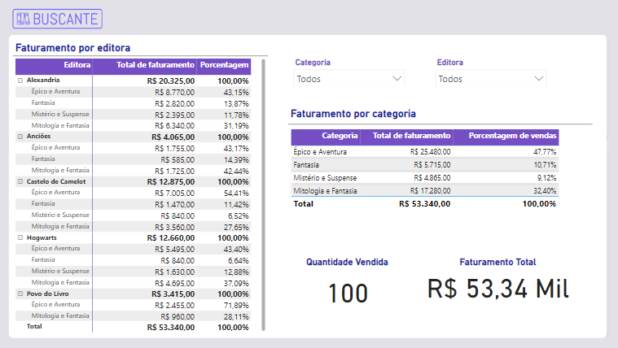

# Aprofundando na Linguagem DAX

Projeto realizado durante o curso de "Power BI - Aprofundando na Linguagem DAX".

## Tópicos abordados:
* Aprenda como criar colunas calculadas e medidas
* Entenda como o contexto é afetado pelos filtros
* Crie medida com a função CALCULATE
* Combinar a função CALCULATE para obter medidas elaboradas
* Entenda como a função CALCULATE sobrescreve ou agrega com outros filtros