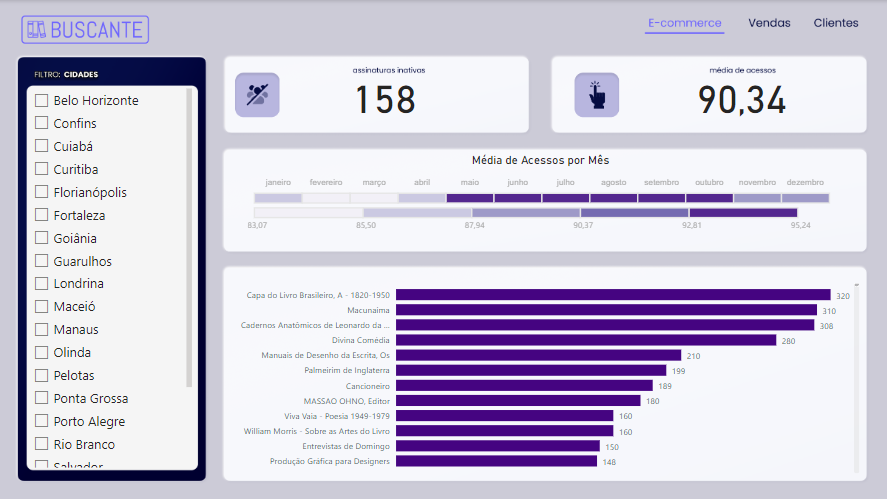
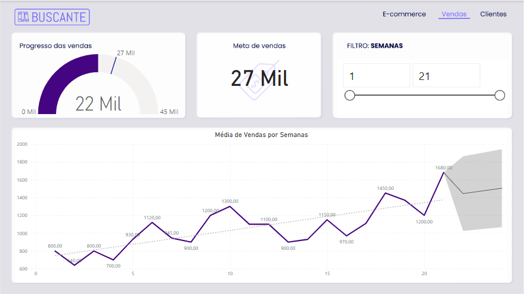
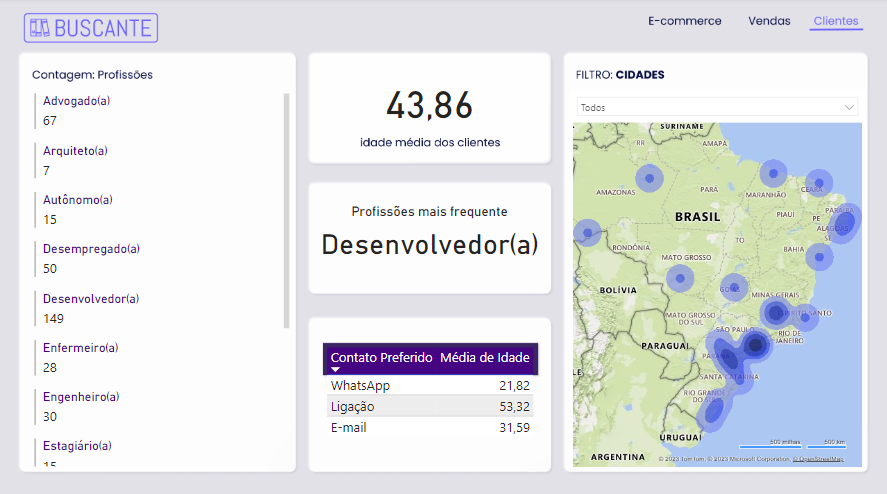

# Buscante - Power BI
Projeto de análise de dados com Power BI, para criação de um Dashboard para visualizar os dados de um E-Commerce.

### Base de dados
* Catálogo livros
* Clientes
* Vendas por semana
* Acessos na página
* Número de livros vendidos

## Tópicos abordados durante esse projeto:
* Identifique gráficos apropriados para as necessidades específicas
* Construa gráficos dentro do Power BI
* Compreenda as possibilidades de como importar visuais externos
* Aplique conceitos de data visualization para comunicar informações de forma eficaz
* Compreenda como trabalhar com séries temporais
* Elabore mapas com os conceitos de latitude e longitude
* Sintetize todos os visuais em um relatório no Power Bi com navegação entre páginas

 

<h3>Contribuindo</h3>

⭐️ Star o projeto

🐛 Encontrar e relatar issues
